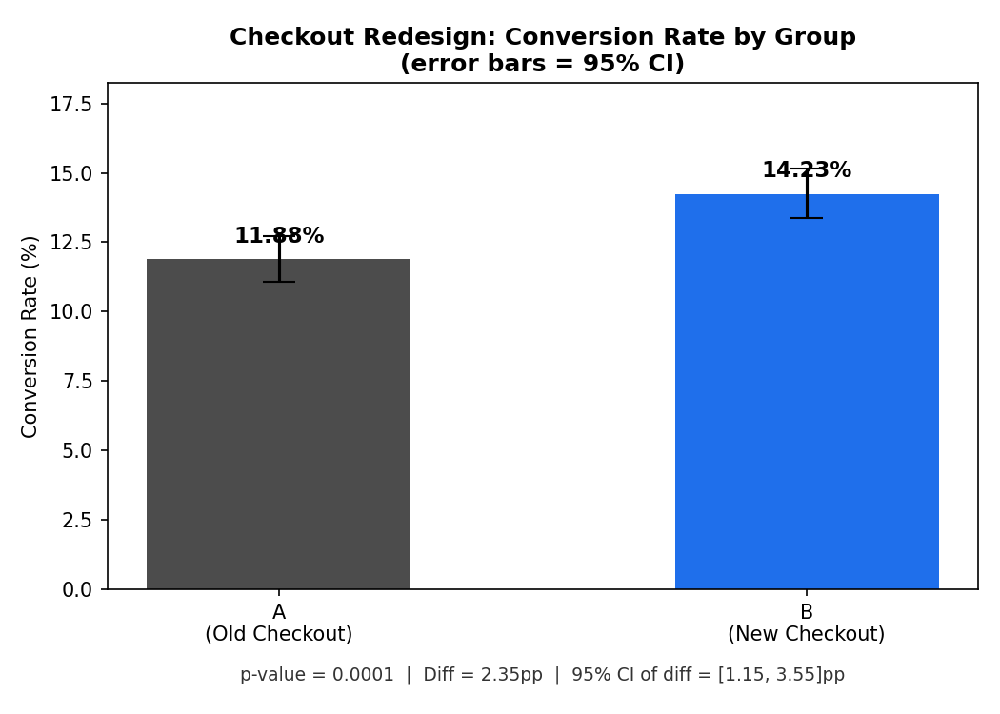
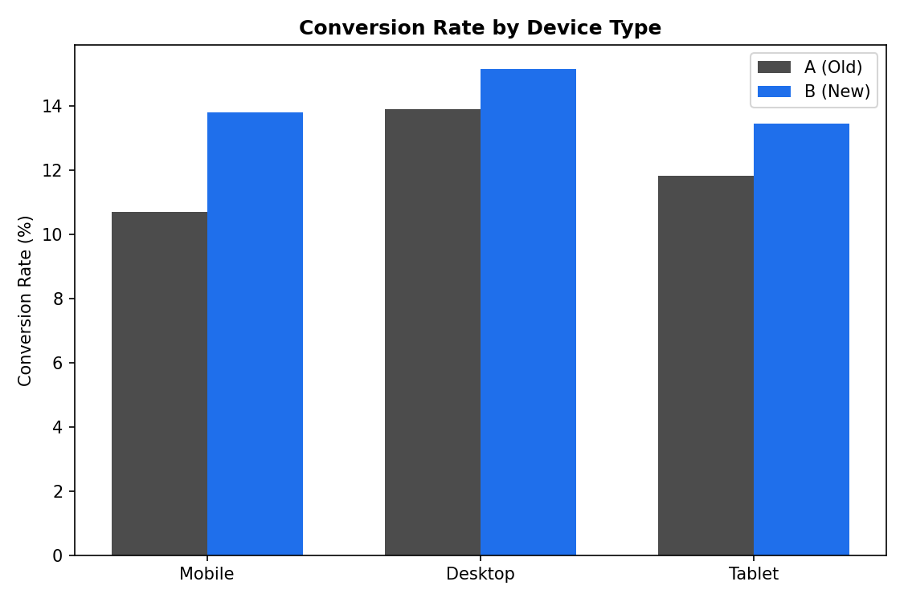

# E-commerce Checkout Redesign — A/B Test Analysis

Determining whether a redesigned checkout flow changed conversion rate, using rigorous statistical inference rather than eyeballing the numbers.

## Problem Statement

An e-commerce team redesigned the checkout flow — replacing a multi-step checkout (**Control / A**) with a streamlined one-page checkout (**Treatment / B**). This project answers one question with statistical evidence:

> **Did the redesign actually change conversion rate, or could the observed difference be due to random chance?**

## Methods Used

| Method | Purpose |
|---|---|
| Two-proportion z-test | Tests whether the conversion rates of A and B are significantly different |
| p-value | Quantifies the strength of evidence against the null hypothesis |
| 95% Confidence Interval | Estimates the plausible range for the true difference in conversion rates |
| Effect size (Cohen's h) | Measures the *practical* magnitude of the difference, independent of sample size |

## Dataset

Simulated dataset (12,000 users, 6,000 per group) with realistic e-commerce fields:
`user_id`, `group`, `device_type`, `traffic_source`, `session_duration_sec`, `converted`, `cart_value_usd`

> Simulated to mirror real-world A/B test structure and effect sizes — built this way so the full analysis pipeline (data → test → decision) is demonstrated end-to-end.

## Results

| Metric | Control (A) | Treatment (B) |
|---|---|---|
| Sample size | 6,000 | 6,000 |
| Conversions | 713 | 854 |
| Conversion rate | 11.88% | 14.23% |

- **Z-statistic:** 3.82
- **p-value:** 0.00013 (< 0.05 → statistically significant)
- **Absolute lift:** +2.35 percentage points
- **Relative lift:** +19.78%
- **95% CI of the difference:** [1.15pp, 3.55pp] — excludes zero
- **Effect size (Cohen's h):** 0.070 — negligible-to-small by conventional standards




## Interpretation

The result is **statistically significant** — the p-value and confidence interval both rule out chance as the explanation. However, the **effect size is small**, which is an important nuance: significance tells you an effect *exists*, effect size tells you how much it *matters*. With large sample sizes, even modest differences become statistically detectable, so both numbers are reported together rather than relying on the p-value alone.

## Business Recommendation

**Ship the new checkout.** A statistically robust ~20% relative lift in conversion is commercially meaningful at scale, and the redesign is low-risk to deploy. Recommended next steps for a real deployment:
- Re-test after a few weeks to rule out a novelty effect
- Monitor revenue per visitor and cart abandonment reasons as guardrail metrics
- Watch mobile conversion specifically, since it's the majority traffic segment

## Project Structure

```
ecommerce_checkout_ab_test/
├── data/
│   ├── generate_data.py          # Simulates the A/B test dataset
│   └── ab_test_checkout_data.csv # Generated dataset (12,000 rows)
├── notebooks/
│   └── ab_test_analysis.ipynb    # Full narrated analysis (run end-to-end)
├── visuals/
│   ├── conversion_rate_comparison.png
│   └── conversion_by_device.png
├── analysis.py                   # Standalone script: stats + hypothesis test
├── visualize.py                  # Standalone script: chart generation
├── results.json                  # Saved test results
└── README.md
```

## How to Run

```bash
pip install numpy pandas statsmodels matplotlib jupyter

python data/generate_data.py   # generate the dataset
python analysis.py             # run the statistical test
python visualize.py            # generate charts
# or open notebooks/ab_test_analysis.ipynb for the full narrated walkthrough
```

## Tools

Python, Pandas, NumPy, Statsmodels, Matplotlib, Jupyter Notebook

## Author

Sanjana Sharma — Final Year BCA (AI & Data Science)
